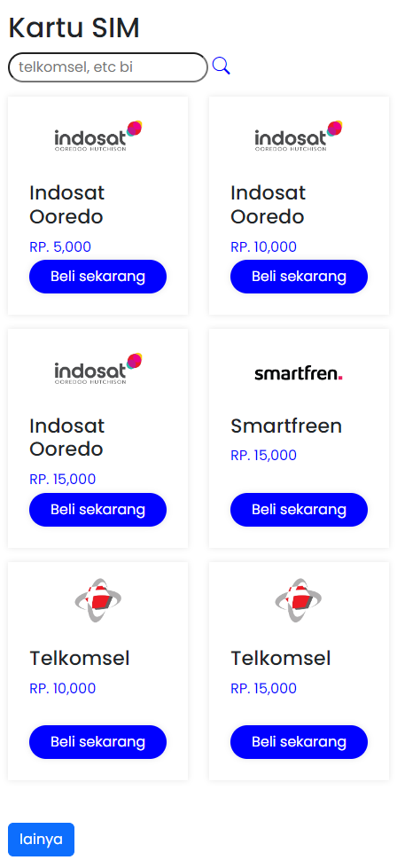
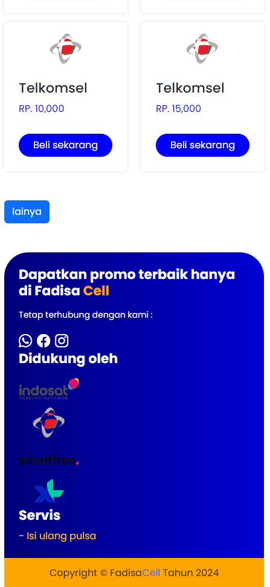

# Nama Proyek
Proyek ini adalah website agen pulsa yang memungkinkan pengguna untuk membeli pulsa dengan mudah. Website ini dilengkapi dengan fitur registrasi dan login, riwayat transaksi, serta pembayaran otomatis melalui berbagai metode. Dibangun dengan PHP, HTML, CSS, serta JavaScript di frontend, sistem ini dirancang untuk memberikan pengalaman transaksi yang cepat, aman, dan nyaman bagi pengguna.
## 📷 Tampilan Proyek


## 📷 Tampilan Pada Mobile
1. 
   
2. 
   
3. 

## 📌 Fitur
- ✅ Fitur login
- ✅ Fitur registrasi
- ✅ Fitur checkout

## 🛠️ Teknologi yang Digunakan
- **Frontend**: HTML, CSS, JavaScript  
- **Backend**: PHP, MySQL  
- **Tools**: XAMPP, GitHub  

## 🚀 Cara Menjalankan Proyek
1. **Clone Repository**
   ```sh
   git clone https://github.com/FaizalDwiSaputra/agenpulsa.git
2. **Import database pulsa**
3. **Jalankan pada localhost**
